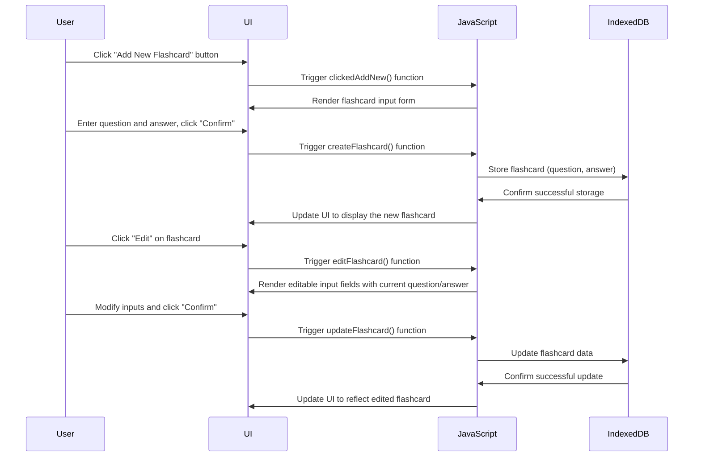

```mermaid
sequenceDiagram
    participant User
    participant UI
    participant JavaScript
    participant IndexedDB

    User->>UI: Click "Add New Flashcard" button
    UI->>JavaScript: Trigger clickedAddNew() function
    JavaScript->>UI: Render flashcard input form
    User->>UI: Enter question and answer, click "Confirm"
    UI->>JavaScript: Trigger createFlashcard() function
    JavaScript->>IndexedDB: Store flashcard (question, answer)
    IndexedDB->>JavaScript: Confirm successful storage
    JavaScript->>UI: Update UI to display the new flashcard
    User->>UI: Click "Edit" on flashcard
    UI->>JavaScript: Trigger editFlashcard() function
    JavaScript->>UI: Render editable input fields with current question/answer
    User->>UI: Modify inputs and click "Confirm"
    UI->>JavaScript: Trigger updateFlashcard() function
    JavaScript->>IndexedDB: Update flashcard data
    IndexedDB->>JavaScript: Confirm successful update
    JavaScript->>UI: Update UI to reflect edited flashcard
```
