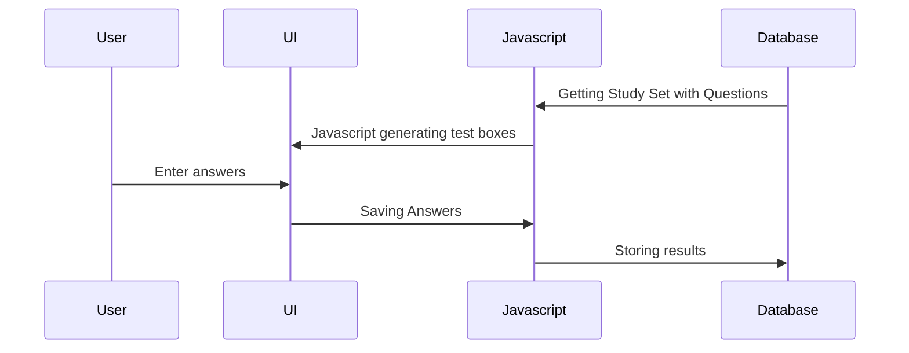

This is the the feature diagram for a test box. Where it displays questions and takes in the user's answers to store the results of the test.

```mermaid
sequenceDiagram
participant User
participant UI
participant Javascript
participant Database

Database->>Javascript: Getting Study Set with Questions
Javascript->>UI: Javascript generating test boxes
User->>UI: Enter answers
UI->>Javascript: Saving Answers
Javascript->>Database: Storing results
```
