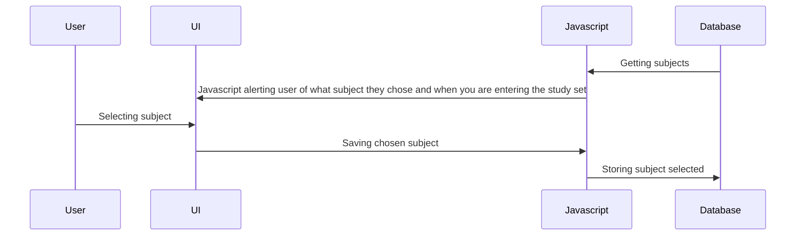

This is the feature diagram for the subjects page. Where it displays multiple common subjects and a more button and takes in the user's choice adn stores it to bring you to the next page.

```mermaid
sequenceDiagram
participant User
participant UI
participant Javascript
participant Database

Database->>Javascript: Getting subjects
Javascript->>UI: Javascript alerting user of what subject they chose and when you are entering the study set
User->>UI: Selecting subject
UI->>Javascript: Saving chosen subject
Javascript->>Database: Storing subject selected
```
